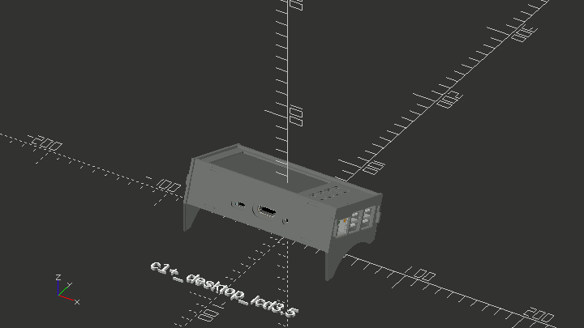

# SBC Case Builder


## Introduction

This project is about autonomous SBC case creation. It utilizes the SBC Model Framework project to automatically generate cases based on the data for any of the current devices contained within the framework. This allows legacy, current and future SBC to have multiple cases available on day one of their inclusion in the framework. There are multiple base case designs available (shell, panel, stacked, tray, tray-sides, round, hex, snap, fitted, folded-paper and standard motherboard adapters) and each allows for customization within the design.

All case openings are created automatically based on SBC data and the dimensions of any case design can be expanded in any axis allowing for the creation of larger cases. If you reposition the SBC in a case, you will see I/O openings created or removed appropriately based on their proximity to the case geometry. These cases might be useful for prototypes or other in house uses to quickly and easily create standard, specialized and custom SBC cases thru different case designs, customization and accessories.

License: GPLv3.



### Install
```
  git clone https://github.com/hominoids/SBC_Case_Builder.git
  cd SBC_Case_Builder
  git submodule init
  git submodule update

```

## SBC Case Builder Features:
-  Autonomous Multi-SBC, Multi-Case Parametric Generation
-  Autonomous SBC and Accessory Model I/O Openings
-  Autonomous Case Standoffs with Variable Height
-  Extended Standoff SBC collision detection
-  Accessory Customization Framework
-  Accessory Multi-Associative Parametric Positioning
   - Absolute Location
   - Case Associations
   - SBC Associations
   - SBC_X,Y - Case_Z Association
-  Graphical User Interface
-  SBC Meta Data Access
-  Individual Standoff Parameter Control
-  Dynamic Heatsink Fan Size, Vent and Mask Openings 
-  Top and Bottom Case Cover Patterns
-  Parametric Bottom Access Panel


### Base Case Designs:
- Shell - complete
- Panel - complete
- Stacked - complete
- Tray - complete
- Tray-Sides - complete
- Tray-Vu5 - complete
- Tray-Vu7 - complete
- Round - complete
- Hex - complete
- Snap - complete
- Fitted - complete
- Paper, Folded - complete
- Standard MB SBC Adapters & io plates - completed
	+ SSI-EEB, SSI-CEB, ATX, Micro-ATX, DTX, Flex-ATX, Mini-DTX, Mini-Itx, Mini-ITX Thin, Mini-STX, Mini-STX Thin
- Standard MB Cases - completed
	+ SSI-EEB, SSI-CEB, ATX, Micro-ATX, DTX, Flex-ATX, Mini-DTX, Mini-ITX, Mini-ITX Thin, Mini-STX, Mini-STX Thin, Nano-ITX, NUC, Pico-ITX
- Sheet Metal, Folded
- Sliding
- Cylinder
- Free Form
- NAS
- Rack
- CNC Cases

All case data is stored in the json file sbc_case_builder.json with the accessory data stored in a separate file structure in sbc_case_builder_accessories.cfg.  An accessory group name for a given case is stored as part of the case data in the json file.  This allows for the reuse or sharing of an accessory set by different cases and can be used to manage groups of accessories.

Variable height automated SBC standoffs, which can be individually adjusted, are also implemented to integrate add-on PCB, hats, heatsinks or other accessories that share SBC standoffs for mounting.


## Graphical User Interface
The GUI has thirteen tabs that control what model and case is displayed, how it is presented, its adjustments, options and associated accessories. There are separate tabs in the GUI for *Folded Case Adjustments*, *Standard Motherboard Case Adjustments* and *3D Case Adjustments*.  The first two have unique settings that only apply to the respective case designs.  3D case adjustments affect all others case designs and some entries can affect Folded and Standard Motherboard cases as well. There are three groups of two tabs each associated with SBC, Extended Case and Multi-PCB standoffs.


### View Tab
The View Tab allows the selection of various viewing modes and the selection of the device model for which a case is being generated.  The *view* pickbox allows the respective case to be displayed as a 3D model, platter for 3D printing and as an individual case part, which can be selected using the *individual part* pickbox.  The *sbc model* pickbox selects the device (SBC, MCU, Motherbaard, etc).  The *sbc off* and *sbc information* are self explanatory.  The *sbc highlight* shows the subtractive openings that are being automatically created by SBC Model Framework while the *accessory highlight* shows the subtractive openings being generated by entries in the file sbc_case_builder_accessories.cfg.  The later is useful when trying to visually place a subtractive accessory.


### Folded Case Adjustments Tab
This tab exclusively deals with folded cases.  At this time the bend allowance equations are not complete and limits its use to paper and other thin materials with a low bend radius.  Once folded metal cases are implemented the bend allowance equations will be complete and allow for any bendable material of any given bend radius.  With that said, these adjustments are used for the paper_full-top and paper_splt-top case designs and the *material thickness* and *bend Allowance* adjustments still need to be set appropriately for the material in use.  The *bottom clearance* adjustment allows additional bottom height adjustment for those wishing to use user provided standoffs on the bottom of the device for better stability.  The *flat blank section* checkbox generates a flat blank based on the aforementioned settings.  Once it has been generated the model must be rendered(F6) to produce a 2D blank that can then be exported as a DXF or SVG file for printing or fed to a CNC cutter.


### Standard Motherboard Case Adjustments Tab
Both standard motherboard adapters and cases can be generated with SBC Case Builder and this tab controls the specific settings. Since it is not possible to know the motherboard thickness it is set to 2mm and the *standard motherboard thickness* setting is used to add or subtract thickness for an accurate representation of the user provided PCB.  The *rear io shield setting is only used when generating full cases and not when generating adapters and io shields.  Most of the adjustments in the *3D Case Adjustments* tab work for motherboard adapters which allows for the SBC or other device to be repositioned on the adapter while providing the full use of the accessory subsystem. Any accessory entries in the sbc_case_builder_accessories.cfg file should reference the bottom face. The *bottom cover pattern* in the *Fan and Vent Openings* tab and the *SBC Bottom Standoff* tabs also apply to motherboard adapters.  There are predefined example cases and adapters available in the GUI for further reference.


### 3D Case Adjustments Tab
The *3D Case Adjustments* tab makes up the bulk of the possible case adjustments for 3D printed cases.  Most of the entries in this tab are self explanatory.  The *pcb loc* adjustments allow the selected device model to be moved in the case design, the *case offset* adjustments increase the selected case design dimensions. The *wallthick*, *floorthick* and *sidethick* adjust their respective areas.  Do note that the *floorthick* adjustment also determines the ceiling thickness for all case designs and the *sidethick* only affects the tray_sides, tray_vu5, tray_vu7 case designs. The *gap* entry is the distance between the device PCB and the sidewall of the case design.  The *tol* adjustment, located at the bottom of the tab, is a  tolerance fitment adjustment for the snap, fitted, round and hex case design tops.  Adjust accordingly if the tops are too tight or loose.


### Fan and Vent Openings Tab
This tab handles the fan and cooling options for case designs.  The *top cover pattern* and *bottom cover pattern* contain several options for the creation of vent patterns that cover the complete top and bottom respectively, including a solid covering.  The *cooling* pickbox selects fan and vent openings exclusively for the heatsink associated with the device in SBC Model Framework.
```
*disable* - turns off the heatsink model and mask
*off* - heatsink model is off, mask is on and default will be used when called.
*default* - heatsink model is on and uses the mask setting in ./SBC_Model_Framework/sbc_models.cfg
*none* - heatsink model is on and mask is off.
fan and vent pattern selections - *open*, *fan_open*, *fan_1*, *fan_2*, *fan_hex*, *vent", *vent_hex_5mm*, *vent_hex_8mm*
*custom* - uses the file ./SBC_Model_Framework/customfan.dxf
```
The *fan size* allows the selection of different fan size masks over the default size selected by 0.


### Bottom Access Panel Tab
This tab allows the creation of a bottom access panel and its entries are self explanatory.  Additional access panels can be implemented using the accessory subsystem.


### Options and Accessories
The entities in this tab allow for the enablement and selection of different GPIO and UART openings based on their type identifier in SBC_Model_Framework.

#### GPIO Selections
```
disable - turns off the GPIO model and mask
off - GPIO model is off, mask is on and default will be used when called
default - GPIO model is on and uses the mask setting stored in ./SBC_Model_Framework/sbc_models.cfg
none - GPIO model is on and mask is off.
mask opening selections - open, block, knockout, vent
```

#### UART Selections
```
default - UART model is on and uses the mask setting stored in ./SBC_Model_Framework/sbc_models.cfg
none - UART model is on and mask is off
mask opening selections - open, knockout
```

The *indent* checkbox enables indents for a select group of component defined in SBC Model Framework.  The currently support components are - video-hmdi_a, video-hdmi_micro, video-hdmi_mini, power-pwr5.5_7.5x11.5, power-pwr2.5_5x7.5, usb2-micro, usbc-single_horizontal, audio-jack_3.5. The *accessory name* pickbox uses the unique accessory group name to associate a given accessory set with a case design.  Entries are stored in the file sbc_case_builder_accessories.cfg which is covered in detail with the Accessory Subsystem in this document.  The remaining two entries select the color and proportional font used with the *sbc information* display when enabled in the *View* tab.


### Standoff Tabs
There are 3 types of standoffs available in the user interface, SBC Standoffs, Extended Case Standoffs and Multi-PCB Standoffs.  The SBC standoffs control adjustments for the SBC or pcbid 0 as defined by the entry in SBC Model Framework file ./SBC_Model_Framework/sbc_models.cfg.  The Extended Case Standoffs control case corner standoffs when the case exceeds the SBC size by the Extended Standoff Support Size.  The Multi-PCB standoffs are used for additional PCB in multi-PCB configurations as defined in ./SBC_Model_Framework/sbc_models.cfg e.g. pcbid 1, pcbid 2, etc.  All three standoff types have similar controls made up of a global tab and individual Settings tab in the GUI.

The main difference between the different standoff groups are that the SBC Standoffs are located by the SBC PCB holes, the Extended Case Standoffs are located in the four corners of a case design that exceeds dimensions of the intended device by the size of the *Extended Case Standoff Support Size* and the Multiple PCB Standoffs are located by the holes of the additional PCBs that makeup a given device.  The entries for the standoffs are basically the same so only the top SBC standoffs will be specifically covered.


#### Standoff Global Settings
The tab *SBC Top Standoff Global Settings* affect all the respective standoffs and starts with three checkboxes. The first, *sbc top standoffs*, enables or disable all the top standoffs.  The second, *top standoff reverse*, rotates the standoff 180 degrees and is used primarily for standoffs associated with the top face of all case designs.  The last, *top sidewall support*, enables or disables the side wall support for all SBC top standoffs.  The first pickbox in the tab is called *top standoff size* and determines the overall size of the SBC top standoffs.  It is made up of named sizes that are predefined and a custom entry that is defined by the remaining entries in the tab.  The predefined named top standoff sizes are further divided into entries where only the hole size is different e.g. m3, m3+, m3_tap.  The m3 entry has a 3mm hole, the m3+ entry's hole is approximately 15% larger for clearance and the m3_tap entry's hole size is the tap drill size.  When a named size is selected the *top standoff diameter* and *top standoff hole size* entries have no effect but the remaining entries do apply - it is the *custom* entry that allows full control of all parameters.

The *top standoff support size* and *top standoff support height* is what allows recessed *top standoff type* entries to work on thin wall 
floors and ceilings by providing the extra size and depth for the given recess.  This applies to the *top standoff type* selections countersunk, recessed and nutholder.  The recessed entry also allows for deep recessed screws by recessing the standoff for the full height of the *standoff support height* less 2mm.  This can be deployed for tall cases in order to use shorter fasteners and is the most practical way to handle this scenario.  The *top standoff insert* checkbox enables the use of inserts of the size defined by *top standoff insert dia* and *top Standoff insert height* at the opposite end of the standoff.  This allows case halves to be fastened together thru the bottom of the case and is another alternative to dealing with tall case designs.


#### Standoff Individual Settings
The SBC Top Individual Settings entries control variable on a per standoff basis.  There are four entry groups each controlling a standoff's enablement, height adjustment and sidewall support location.  This are useful when dealing with hats or other accessories that share SBC PCB holes for mounting.  Likewise, being able to change the direction of the sidewall support allows for a wider choice to strengthen and tie the standoff to the case walls or completely disable them if SBC components interfere.  The length of the sidewall support is equal to the respective *standoff support size* for SBC, Extended Case and  Multi-PCB standoffs.

As indicated previously, The SBC Standoffs, Extended Case Standoffs and Multi-PCB Standoffs all work the same with the following exceptions. The *standoff support size* is also used to determine the corner proximity for the Extended Case standoffs.  The Multiple PCB Standoffs present a unique challenge due to their nature.  There will be situations with multiple PCB devices when not all the standoffs created by the PCB holes will be needed.  Imagine two PCBs next to each other that would normally create eight standoffs.  In many scenarios only outer standoffs are needed for both the top and bottom and the bottom inner standoffs for PCB support.  In order to handle this and many other situations without creating a complex and burdensome GUI, an entry for the creation of the PCB hole can be used to disable the top, bottom or both standoffs.  This is accomplished within the SBC Model Framework pcbhole class.  The person creating the sbc_models.cfg entry can determine and override the creation of these standoffs in SBC Case Builder.  See the SBC Model Framework pcbhole class for further details.


## Accessory Subsystem
Case accessories entries are kept in the file sbc_case_builder_accessories.cfg. Newly created accessory group names also need to be added to the variable accessory_name in sbc_models.scad on or around line #128 in order for them to appear in the GUI pickbox.  Any new accessory group names must be added to the pickbox entry or they will not be present in the GUI. This can be done manually or the helper script get_customizer_values.scad can be used.

### Accessory Schema
Each accessory group consists of a unique name followed by an unlimited number of accessory entries each containing 11 variables.
```
schema:

"accessory_name",
"class","type",loc_x,loc_y,loc_z,face,rotation[x,y,z],parametrics[association,x,y,z],size[],data[],mask[]
```

### Accessories Entries
There are 6 classes, “add1”,“sub”,”suball”,”add2”,”model”,”platter” and all use the same command format for various “type”.
```
"class","type",loc_x,loc_y,loc_z,face,rotation[x,y,z],parametrics[association,x,y,z],size[],data[],mask[]
```
e.g.
```
                                              p
                                              a
                                              r
                                     r        a                                               s
                                     o        m                                               e
                                     t        e                           s s s             l t    m
       c          l  l  l            a        t                           i i i             e      s
       l      t   o  o  o      f     t        r                           z z z   d     m   n b    t
       a      y   c  c  c      a     i        i                           e e e   a     a   g a    y
       s      p                c     o        c                                   t     s   t c    l
       s,     e,  x, y, z,     e,    n,       s,                          x,y,z,  a,    k   h k    e

     "sub","fan",10,10,24.5,"top",[0,0,0],["sbc-case_z",true,true,true],[40,0,6],[0],[true,10,2,"default"],
```
  
Every type, regardless of its class, uses a basic set of variables
`(loc_x,loc_y,loc_z,”face”,rotation[],parametrics[])`
but each type doesn’t necessarily use all available data fields
`(size[],data[])`

Multi-associative parametric positioning of accessories is implemented and allows each accessory to enable or disable parametric movement of the accessory for each axis.  The XY and Z axis can be associated with the case offset (size), SBC positioning, multi-associated axis's or absolute positioning.  For instance, a SBC fan opening needs to follow the SBC in the X and Y axis but the case Z axis for the correct height.  The parametric array specifies the axis to enable for associated parametric positioning. An accessory can be associated with the sbc position("sbc"), case offset("case"),multi-associated which use sbc xy position and case z offset("sbc-case_z") or use absolute values if all axis's are false.  In the accessory example above, the 8th parameter `["sbc-case_z",true,true,true]` means all axis's are enabled for multi-associative movement with the X and Y accessory axis following the SBC X and Y axis and the accessory Z axis following the case Z axis. The other currently supported associations are “sbc” and “case”.

### classes: add1, sub, suball, add2, model, platter

Class “add1” and “add2” are used to add geometry to the case. The difference is when the addition occurs. “add1” happens at the beginning when the core case geometry is created before any subtractions and add2 happens at the end after all subtractions have occurred. “suball” is used to affect all faces of a case, not just a single face. The “face” is the case piece that will be effected by the addition or subtraction. The "model" class is for placing supporting accessories in the model view. e.g. hard drives, fans. The "platter" class is for adding supporting accessories that are not part of the core case geometry to the print platter for printing e.g. an access panel.


**additive type:**

art, access_panel, batt_holder, button, button_assembly, fan_cover, feet, hd_holder, hk_boom_grill, hk_boom_speaker_holder, hk_boom_vring, hk_h3_port_extender_holder, hk_hc4_oled_holder, hk_uart_holder, hk_uart_strap, keyhole, nut_holder, pcb_holder, rectangle, round, slot, sphere, standoff, text, vent_panel_hex, uart_holder, hc4_oled_holder, button, pcb_holder


**subtractive type:**

art, fan_mask, hd_holes, knockout, rectangle, round, slot, sphere, text, vent, vent_hex


**model type:**

access_cover, adafruit_lcd, dsub, fan, hd25, hd35, hk_boom, hk_boom_speaker, hk_h3_port_extender, hk_hc4_oled, hk35_lcd, hk_m1s_ups, hk_net_card, hk_pwr_button, hk_speaker, hk_uart, hk_vu7c, hk_vu8m, hk_vu8s, hk_wb2, hk_xu4_shifter_shield, rpi_m2hat, stl_model


**platter type:**

access_cover, button_assembly, fan_cover, feet, hk_boom_vring, hk_h3_port_extender_holder, hk_uart_strap, vent_panel_hex


## Accessory Reference Manual


### Add1 and Add2 class “types”


### access_cover

```
    CLASSES: add1, add2, platter
DESCRIPTION: creates bottom access cover for access panels.
       MASK: no
      USAGE: "class", "access_cover", loc_x, loc_y, loc_z, face, rotation[], parametric[], size[], data[], mask[]

              class = "add1", "add2", "platter"
               type = "access_cover"
              loc_x = x location placement
              loc_y = y location placement
              loc_z = z location placement
               face = "top", "bottom", "right", "left", "front", "rear"
         rotation[] = object rotation
       parametric[] = "case", "sbc", "sbc-case_z"
            size[0] = x dimension
            size[1] = y dimension
            size[2] = floor thickness
            data[0] = "portrait", "landscape"
            mask[0] = false, not used
            mask[1] = length
            mask[2] = set back
            mask[3] = mstyle "default"
```


### access_panel

```
    CLASSES: add2
DESCRIPTION: creates bottom access panels.
       MASK: yes
      USAGE: "class", "access_panel", loc_x, loc_y, loc_z, face, rotation[], parametric[], size[], data[], mask[]

              class = "add2"
               type = "access_panel"
              loc_x = x location placement
              loc_y = y location placement
              loc_z = z location placement
               face = "top", "bottom", "right", "left", "front", "rear"
         rotation[] = object rotation
       parametric[] = "case", "sbc", "sbc-case_z"
            size[0] = x dimension
            size[1] = y dimension
            size[2] = floor thickness
            data[0] = "portrait", "landscape"
            mask[0] = true
            mask[1] = length
            mask[2] = set back
            mask[3] = mstyle "default"
```


### art

```
    CLASSES: add1, add2, sub, suball
DESCRIPTION: creates or subtracts art work geometry in dxf or svg format.
       MASK: no
      USAGE: "class", "art", loc_x, loc_y, loc_z, face, rotation[], parametric[], size[], data[], mask[]

              class = "add1", "add2", "sub", "suball"
               type = "art"
              loc_x = x location placement
              loc_y = y location placement
              loc_z = z location placement
               face = "top", "bottom", "right", "left", "front", "rear"
         rotation[] = object rotation
       parametric[] = "case", "sbc", "sbc-case_z"
             size[] = not used
            data[0] = scale
            data[1] = height
            data[2] = "file"
            mask[0] = false, not used
            mask[1] = length
            mask[2] = set back
            mask[3] = mstyle "default"
```


### battery_holder

```
    CLASSES: add1, add2
DESCRIPTION: creates battery holder for coin cr2032 batteries.
       MASK: no
      USAGE: "class", "battery_holder", loc_x, loc_y, loc_z, face, rotation[], parametric[], size[], data[], mask[]

              class = "add1", "add2"
               type = "battery_holder"
              loc_x = x location placement
              loc_y = y location placement
              loc_z = z location placement
               face = "top", "bottom", "right", "left", "front", "rear"
         rotation[] = object rotation
       parametric[] = "case", "sbc", "sbc-case_z"
             size[] = not used
            data[0] = tolerance adjustment
            mask[0] = false, not used
            mask[1] = length
            mask[2] = set back
            mask[3] = mstyle "default"
```


### button

```
    CLASSES: add2
DESCRIPTION: adds various button styles.
       MASK: yes
      USAGE: "add2", "button", loc_x, loc_y, loc_z, face, rotation[], parametric[], size[], data[], mask[]

              class = "add2"
               type = "button"
              loc_x = x location placement
              loc_y = y location placement
              loc_z = z location placement
               face = "top", "bottom", "right", "left", "front", "rear"
         rotation[] = object rotation
       parametric[] = "case", "sbc", "sbc-case_z"
            size[0] = diameter of button body for recess style
            size[1] = not used
            size[2] = height above button for recess style
            data[0] = "recess", "cutout"
            data[1] = radius for cutout style
            data[2] = button post size for cutout style
            mask[0] = true
            mask[1] = length
            mask[2] = set back
            mask[3] = mstyle "default"
```


### button_assembly

```
    CLASSES: add2, platter
DESCRIPTION: adds button assembly for recess button style.
       MASK: yes
      USAGE: "add2", "button_assembly", loc_x, loc_y, loc_z, face, rotation[], parametric[], size[], data[], mask[]

              class = "add2"
               type = "button_assembly"
              loc_x = x location placement
              loc_y = y location placement
              loc_z = z location placement
               face = "top", "bottom", "right", "left", "front", "rear"
         rotation[] = object rotation
       parametric[] = "case", "sbc", "sbc-case_z"
            size[0] = diameter of button body for recess style
            size[1] = not used
            size[2] = height above button for recess style
            data[0] = "recess"
            mask[0] = true
            mask[1] = length
            mask[2] = set back
            mask[3] = mstyle "default"
```


### fan_cover

```
    CLASSES: add1, add2, platter
DESCRIPTION: creates fan cover for fan openings.
       MASK: no
      USAGE: "class", "fan_cover", loc_x, loc_y, loc_z, face, rotation[], parametric[], size[], data[], mask[]

              class = "add1", "add2", "platter"
               type = "fan_cover"
              loc_x = x location placement
              loc_y = y location placement
              loc_z = z location placement
               face = "top", "bottom", "right", "left", "front", "rear"
         rotation[] = object rotation
       parametric[] = "case", "sbc", "sbc-case_z"
            size[0] = fan size
            size[1] = not used
            size[2] = cover thickness
            data[0] = "fan_open", "fan_1", "fan_2", "fan_hex"
            mask[0] = false, not used
            mask[1] = length
            mask[2] = set back
            mask[3] = mstyle "default"
```


### feet

```
    CLASSES: add1, add2, platter
DESCRIPTION: creates case feet.
       MASK: no
      USAGE: "class", "feet", loc_x, loc_y, loc_z, face, rotation[], parametric[], size[], data[], mask[]

              class = "add1", "add2", "platter"
               type = "feet"
              loc_x = x location placement
              loc_y = y location placement
              loc_z = z location placement
               face = "top", "bottom", "right", "left", "front", "rear"
         rotation[] = object rotation
       parametric[] = "case", "sbc", "sbc-case_z"
            size[0] = feet diameter
            size[1] = not used
            size[2] = feet height
             data[] = not used
            mask[0] = false, not used
            mask[1] = length
            mask[2] = set back
            mask[3] = mstyle "default"
```


### hd_holder

```
    CLASSES: add1, add2
DESCRIPTION: creates a horizontal double stacked holder for 2.5 and 3.5 drives.
       MASK: no
      USAGE: "class", "hd_holder", loc_x, loc_y, loc_z, face, rotation[], parametric[], size[], data[], mask[]

              class = "add1", "add2"
               type = "hd_holder"
              loc_x = x location placement
              loc_y = y location placement
              loc_z = z location placement
               face = "top", "bottom", "right", "left", "front", "rear"
         rotation[] = object rotation
       parametric[] = "case", "sbc", "sbc-case_z"
             size[] = not used
            data[0] = 2.5 or 3.5
            data[1] = ”portrait”, “landscape”
            mask[0] = false, not used
            mask[1] = length
            mask[2] = set back
            mask[3] = mstyle "default"
```


### hd_vertleft_holder

```
    CLASSES: add1, add2
DESCRIPTION: creates a vertical left facing holder for 2.5 and 3.5 drives.
       MASK: no
      USAGE: "class", "hd_vertleft_holder", loc_x, loc_y, loc_z, face, rotation[], parametric[], size[], data[], mask[]

              class = "add1", "add2"
               type = "hd_vertleft_holder"
              loc_x = x location placement
              loc_y = y location placement
              loc_z = z location placement
               face = "top", "bottom", "right", "left", "front", "rear"
         rotation[] = object rotation
       parametric[] = "case", "sbc", "sbc-case_z"
             size[] = not used
            data[0] = 2.5 or 3.5
            data[1] = ”portrait”, “landscape”
            mask[0] = false, not used
            mask[1] = length
            mask[2] = set back
            mask[3] = mstyle "default"
```


### hd_vertright_holder

```
    CLASSES: add1, add2
DESCRIPTION: creates a vertical right facing holder for 2.5 and 3.5 drives.
       MASK: no
      USAGE: "class", "hd_vertright_holder", loc_x, loc_y, loc_z, face, rotation[], parametric[], size[], data[], mask[]

              class = "add1", "add2"
               type = "hd_vertright_holder"
              loc_x = x location placement
              loc_y = y location placement
              loc_z = z location placement
               face = "top", "bottom", "right", "left", "front", "rear"
         rotation[] = object rotation
       parametric[] = "case", "sbc", "sbc-case_z"
             size[] = not used
            data[0] = 2.5 or 3.5
            data[1] = ”portrait”, “landscape”
            mask[0] = false, not used
            mask[1] = length
            mask[2] = set back
            mask[3] = mstyle "default"
```


### hk_boom_grill

```
    CLASSES: add2
DESCRIPTION: creates hk boom bonnet grill covers.
       MASK: yes
      USAGE: "class", "hk_boom_grill", loc_x, loc_y, loc_z, face, rotation[], parametric[], size[], data[], mask[]

              class = "add2"
               type = "hk_boom_grill"
              loc_x = x location placement
              loc_y = y location placement
              loc_z = z location placement
               face = "top", "bottom", "right", "left", "front", "rear"
         rotation[] = object rotation
       parametric[] = "case", "sbc", "sbc-case_z"
            size[0] = not used
            size[1] = not used
            size[2] = wall thickness
            data[0] = "flat", "dome", "frame"
            mask[0] = true
            mask[1] = length
            mask[2] = set back
            mask[3] = mstyle "default"
```


### hk_boom_speaker_holder

```
    CLASSES: add2, platter
DESCRIPTION: creates hk boom bonnet speaker clamp and friction style holder.
       MASK: no
      USAGE: "class", "hk_boom_speaker_holder", loc_x, loc_y, loc_z, face, rotation[], parametric[], size[], data[], mask[]

              class = "add2"
               type = "hk_boom_speaker_holder"
              loc_x = x location placement
              loc_y = y location placement
              loc_z = z location placement
               face = "top", "bottom", "right", "left", "front", "rear"
         rotation[] = object rotation
       parametric[] = "case", "sbc", "sbc-case_z"
             size[] = not used
            data[0] = "friction", "clamp"
            data[1] = tolerance adjustment
            mask[0] = false
            mask[1] = length
            mask[2] = set back
            mask[3] = mstyle "default"
```


### hk_boom_vring

```
    CLASSES: add1, add2, platter
DESCRIPTION: creates hk stereo boom bonnet volume wheel extention.
       MASK: no
      USAGE: "class", "hk_boom_vring", loc_x, loc_y, loc_z, face, rotation[], parametric[], size[], data[], mask[]

              class = "add1", "add2", "platter"
               type = "hk_boom_vring"
              loc_x = x location placement
              loc_y = y location placement
              loc_z = z location placement
               face = "top", "bottom", "right", "left", "front", "rear"
         rotation[] = object rotation
       parametric[] = "case", "sbc", "sbc-case_z"
             size[] = not used
            data[0] = tolerance adjustment
            mask[0] = false
            mask[1] = length
            mask[2] = set back
            mask[3] = mstyle "default"
```


### hk_h3_port_extender_holder

```
    CLASSES: add1, add2, platter
DESCRIPTION: creates odroid-h3 port extender holder parts.
       MASK: no
      USAGE: "class", "hk_h3_port_extender_holder", loc_x, loc_y, loc_z, face, rotation[], parametric[], size[], data[], mask[]

              class = "add1", "add2", "platter"
               type = "hk_h3_port_extender_holder"
              loc_x = x location placement
              loc_y = y location placement
              loc_z = z location placement
               face = "top", "bottom", "right", "left", "front", "rear"
         rotation[] = object rotation
       parametric[] = "case", "sbc", "sbc-case_z"
             size[] = not used
            data[0] = distance from mount face
            data[1] = "top", "bottom", "both"
            mask[0] = false
            mask[1] = length
            mask[2] = set back
            mask[3] = mstyle "default"
```


### hk_hc4_oled_holder

```
    CLASSES: add2
DESCRIPTION: creates a holder for the hk odroid-hc4 oled display.
       MASK: yes
      USAGE: "class", "hk_hc4_oled_holder", loc_x, loc_y, loc_z, face, rotation[], parametric[], size[], data[], mask[]

              class = "add2"
               type = "hk_hc4_oled_holder"
              loc_x = x location placement
              loc_y = y location placement
              loc_z = z location placement
               face = "top", "bottom", "right", "left", "front", "rear"
         rotation[] = object rotation
       parametric[] = "case", "sbc", "sbc-case_z"
            size[0] = not used
            size[1] = not used
            size[2] = floor thickness
             data[] = not used
            mask[0] = true
            mask[1] = length
            mask[2] = set back
            mask[3] = mstyle "default"
```


### hk_uart_holder

```
    CLASSES: add2
DESCRIPTION: creates a holder for the hk micro-usb uart.
       MASK: yes
      USAGE: "class", "hk_uart_holder", loc_x, loc_y, loc_z, face, rotation[], parametric[], size[], data[], mask[]

              class = "add2"
               type = "hk_uart_holder"
              loc_x = x location placement
              loc_y = y location placement
              loc_z = z location placement
               face = "top", "bottom", "right", "left", "front", "rear"
         rotation[] = object rotation
       parametric[] = "case", "sbc", "sbc-case_z"
             size[] = not used
             data[] = not used
            mask[0] = true
            mask[1] = length
            mask[2] = set back
            mask[3] = mstyle "default"
```


### hk_uart_strap

```
    CLASSES: add2, platter
DESCRIPTION: creates a strap for the hk micro-usb uart holder.
       MASK: no
      USAGE: "class", "hk_uart_holder", loc_x, loc_y, loc_z, face, rotation[], parametric[], size[], data[], mask[]

              class = "add2"
               type = "hk_uart_holder"
              loc_x = x location placement
              loc_y = y location placement
              loc_z = z location placement
               face = "top", "bottom", "right", "left", "front", "rear"
         rotation[] = object rotation
       parametric[] = "case", "sbc", "sbc-case_z"
             size[] = not used
             data[] = not used
            mask[0] = false
            mask[1] = length
            mask[2] = set back
            mask[3] = mstyle "default"
```


### keyhole

```
    CLASSES: add1, add2
DESCRIPTION: creates enclosed keyhole.
       MASK: yes
      USAGE: "class", "keyhole", loc_x, loc_y, loc_z, face, rotation[], parametric[], size[], data[], mask[]

              class = "add1", "add2"
               type = "keyhole"
              loc_x = x location placement
              loc_y = y location placement
              loc_z = z location placement
               face = "top", "bottom", "right", "left", "front", "rear"
         rotation[] = object rotation
       parametric[] = "case", "sbc", "sbc-case_z"
             size[] = not used
            data[0] = [head_dia, slot_width, slot_length, floor_thick]
            mask[0] = true
            mask[1] = length
            mask[2] = set back
            mask[3] = mstyle "default"
```


### nut_holder

```
    CLASSES: add1, add2
DESCRIPTION: creates nut holder of various styles.
       MASK: no
      USAGE: "class", "nut_holder", loc_x, loc_y, loc_z, face, rotation[], parametric[], size[], data[], mask[]

              class = "add1", "add2"
               type = "nut_holder"
              loc_x = x location placement
              loc_y = y location placement
              loc_z = z location placement
               face = "top", "bottom", "right", "left", "front", "rear"
         rotation[] = object rotation
       parametric[] = "case", "sbc", "sbc-case_z"
            size[0] = top diameter or x size in mm
            size[1] = bottom diameter or y size in mm
            size[2] = holder height in mm
            data[0] = "m2", "m2.5", "m3", "m4"
            data[1] = "default", "sloped", "trap"
            mask[0] = true
            mask[1] = length
            mask[2] = set back
            mask[3] = mstyle "default"
```


### pcb_holder

```
    CLASSES: add1, add2
DESCRIPTION: creates pcb holder for vertical mounting.
       MASK: no
      USAGE: "class", "pcb_holder", loc_x, loc_y, loc_z, face, rotation[], parametric[], size[], data[], mask[]

              class = "add1", "add2"
               type = "pcb_holder"
              loc_x = x location placement
              loc_y = y location placement
              loc_z = z location placement
               face = "top", "bottom", "right", "left", "front", "rear"
         rotation[] = object rotation
       parametric[] = "case", "sbc", "sbc-case_z"
            size[0] = pcb x size in mm
            size[1] = pcb y size in mm
            size[2] = pcb z size in mm
            data[0] = holder wall thickness
            mask[0] = false
            mask[1] = length
            mask[2] = set back
            mask[3] = mstyle "default"
```


### rectangle

```
    CLASSES: add1, add2, sub, suball
DESCRIPTION: creates or subtracts rectangular geometry with individual defined corner fillets. 
             Radius1 is lower left corner then moves clockwise.
       MASK: no
      USAGE: "class", "rectangle", loc_x, loc_y, loc_z, face, rotation[], parametric[], size[], data[], mask[]

              class = "add1", "add2", "sub", "suball"
               type = "rectangle"
              loc_x = x location placement
              loc_y = y location placement
              loc_z = z location placement
               face = "top", "bottom", "right", "left", "front", "rear"
         rotation[] = object rotation
       parametric[] = "case", "sbc", "sbc-case_z"
            size[0] = width
            size[1] = depth
            size[2] = height
            data[0] = [radius1, radius2, radius3, radius4]
            mask[0] = false, not used
            mask[1] = length
            mask[2] = set back
            mask[3] = mstyle "default"
```


### round

```
    CLASSES: add1, add2, sub, suball
DESCRIPTION: creates or subtracts circular geometry.
       MASK: no
      USAGE: "class", "round", loc_x, loc_y, loc_z, face, rotation[], parametric[], size[], data[], mask[]

              class = "add1", "add2", "sub", "suball"
               type = "round"
              loc_x = x location placement
              loc_y = y location placement
              loc_z = z location placement
               face = "top", "bottom", "right", "left", "front", "rear"
         rotation[] = object rotation
       parametric[] = "case", "sbc", "sbc-case_z"
            size[0] = diameter
            size[1] = not used
            size[2] = height
             data[] = not used
            mask[0] = false, not used
            mask[1] = length
            mask[2] = set back
            mask[3] = mstyle "default"
```


### slot

```
    CLASSES: add1, add2, sub, suball
DESCRIPTION: creates or subtracts slot geometry.
       MASK: no
      USAGE: "class", "slot", loc_x, loc_y, loc_z, face, rotation[], parametric[], size[], data[], mask[]

              class = "add1", "add2", "sub", "suball"
               type = "slot"
              loc_x = x location placement
              loc_y = y location placement
              loc_z = z location placement
               face = "top", "bottom", "right", "left", "front", "rear"
         rotation[] = object rotation
       parametric[] = "case", "sbc", "sbc-case_z"
            size[0] = diameter
            size[1] = length
            size[2] = height
             data[] = not used
            mask[0] = false, not used
            mask[1] = length
            mask[2] = set back
            mask[3] = mstyle "default"
```


### sphere

```
    CLASSES: add1, add2, sub, suball
DESCRIPTION: creates or subtracts sphere geometry.
       MASK: no
      USAGE: "class", "sphere", loc_x, loc_y, loc_z, face, rotation[], parametric[], size[], data[], mask[]

              class = "add1", "add2", "sub", "suball"
               type = "sphere"
              loc_x = x location placement
              loc_y = y location placement
              loc_z = z location placement
               face = "top", "bottom", "right", "left", "front", "rear"
         rotation[] = object rotation
       parametric[] = "case", "sbc", "sbc-case_z"
            size[0] = diameter
            size[1] = not used
            size[2] = not used
             data[] = not used
            mask[0] = false, not used
            mask[1] = length
            mask[2] = set back
            mask[3] = mstyle "default"
```


### standoff

```
    CLASSES: add2
DESCRIPTION: creates standoffs.
       MASK: yes
      USAGE: "add2", "standoff", loc_x, loc_y, loc_z, face, rotation[], parametric[], size[], data[], mask[]

              class = "add2"
               type = "standoff"
              loc_x = x location placement
              loc_y = y location placement
              loc_z = z location placement
               face = "top", "bottom"
         rotation[] = object rotation
       parametric[] = "case", "sbc", "sbc-case_z"
             size[] = not used
            data[0] = [size,diameter,height,holesize,supportsize,supportheight,sink,pillarstyle,pillarsupport,reverse,insert_e,i_dia,i_depth]

                       size = "m2_tap","m2","m2+","m2.5_tap","m2.5","m2.5+","m3_tap","m3","m3+","m4_tap","m4","m4+","custom"
                       diameter = pillar radius
                       height = total height
                       holesize = hole diameter
                       supportsize = support size for sink
                       supportheight = height of support for sink
                       sink = "none", "countersunk", "recessed", "nut holder", "blind"
                       pillarstyle = "hex", "round"
                       pillarsupport = "none", "left", "rear", "front", "right"
                       reverse = true or false
                       insert_e = true or false
                       i_dia = insert diameter
                       i_depth = insert hole depth

            mask[0] = true
            mask[1] = length
            mask[2] = set back
            mask[3] = mstyle "default"
```


### text

```
    CLASSES: add1, add2, sub, suball
DESCRIPTION: creates or subtracts raised or sunk text geometry.
       MASK: no
      USAGE: "class", "text", loc_x, loc_y, loc_z, face, rotation[], parametric[], size[], data[], mask[]

              class = "add1", "add2", "sub", "suball"
               type = "text"
              loc_x = x location placement
              loc_y = y location placement
              loc_z = z location placement
               face = "top", "bottom", "right", "left", "front", "rear"
         rotation[] = object rotation
       parametric[] = "case", "sbc", "sbc-case_z"
             size[] = not used
            data[0] = text size
            data[1] = "text"
            mask[0] = false, not used
            mask[1] = length
            mask[2] = set back
            mask[3] = mstyle "default"
```


### vent_panel_hex

```
    CLASSES: add1, add2, platter
DESCRIPTION: creates hex pattern covers for vent openings.
       MASK: no
      USAGE: "class", "vent_panel_hex", loc_x, loc_y, loc_z, face, rotation[], parametric[], size[], data[], mask[]

              class = "add1", "add2"
               type = "vent_panel_hex"
              loc_x = x location placement
              loc_y = y location placement
              loc_z = z location placement
               face = "top", "bottom", "right", "left", "front", "rear"
         rotation[] = object rotation
       parametric[] = "case", "sbc", "sbc-case_z"
            size[0] = #rows
            size[1] = #columns
            size[2] = thickness
            data[0] = size of hex
            data[1] = space between hex
            data[2] = size of borber
            data[3] = type of border "none", "default"
            mask[0] = false, not used
            mask[1] = length
            mask[2] = set back
            mask[3] = mstyle "default"
```


## Sub and Suball class “types”


### art

```
    CLASSES: add1, add2, sub, suball
DESCRIPTION: creates or subtracts art work geometry in dxf or svg format.
       MASK: no
      USAGE: "class", "art", loc_x, loc_y, loc_z, face, rotation[], parametric[], size[], data[], mask[]

              class = "add1", "add2", "sub", "suball"
               type = "art"
              loc_x = x location placement
              loc_y = y location placement
              loc_z = z location placement
               face = "top", "bottom", "right", "left", "front", "rear"
         rotation[] = object rotation
       parametric[] = "case", "sbc", "sbc-case_z"
             size[] = not used
            data[0] = scale
            data[1] = height
            data[2] = "file"
            mask[0] = false, not used
            mask[1] = length
            mask[2] = set back
            mask[3] = mstyle "default"
```


### fan_mask

```
    CLASSES: sub, suball
DESCRIPTION: creates fan openings in various styles and sizes.
       MASK: no
      USAGE: "class", "fan_mask", loc_x, loc_y, loc_z, face, rotation[], parametric[], size[], data[], mask[]

              class = "sub", "suball"
               type = "fan_mask"
              loc_x = x location placement
              loc_y = y location placement
              loc_z = z location placement
               face = "top", "bottom", "right", "left", "front", "rear"
         rotation[] = object rotation
       parametric[] = "case", "sbc", "sbc-case_z"
            size[0] = fan size of opening
            size[1] = not used
            size[2] = thickness
            data[0] = "fan_open", "fan_1", "fan_2", "fan_hex"
            mask[0] = false, not used
            mask[1] = length
            mask[2] = set back
            mask[3] = mstyle "default"
```


### hd_holes

```
    CLASSES: sub, suball
DESCRIPTION: creates hard drive holes for 2.5 and 3.5 drives in various orientations.
       MASK: no
      USAGE: "class", "hd_holes", loc_x, loc_y, loc_z, face, rotation[], parametric[], size[], data[], mask[]

              class = "sub", "suball"
               type = "hd_holes"
              loc_x = x location placement
              loc_y = y location placement
              loc_z = z location placement
               face = "top", "bottom", "right", "left", "front", "rear"
         rotation[] = object rotation
       parametric[] = "case", "sbc", "sbc-case_z"
             size[] = not used
            data[0] = 2.5 or 3.5
            data[1] = "portrait", "landscape"
            data[2] = "left", "right", "both", "bottom", "all"
            data[3] = floor thickness
            mask[0] = false, not used
            mask[1] = length
            mask[2] = set back
            mask[3] = mstyle "default"
```


### knockout

```
    CLASSES: sub, suball
DESCRIPTION: creates knockouts in rectangle, round or slot shape.
       MASK: no
      USAGE: "class", "knockout", loc_x, loc_y, loc_z, face, rotation[], parametric[], size[], data[], mask[]

              class = "sub", "suball"
               type = "knockout"
              loc_x = x location placement
              loc_y = y location placement
              loc_z = z location placement
               face = "top", "bottom", "right", "left", "front", "rear"
         rotation[] = object rotation
       parametric[] = "case", "sbc", "sbc-case_z"
            size[0] = length
            size[1] = height
            size[2] = thickness
            data[0] = gap
            data[1] = fillet size
            data[2] = "slot", "rectangle", "round"
            mask[0] = false, not used
            mask[1] = length
            mask[2] = set back
            mask[3] = mstyle "default"
```


### rectangle

```
    CLASSES: add1, add2, sub, suball
DESCRIPTION: creates or subtracts rectangular geometry with individual defined corner fillets. 
             Radius1 is lower left corner then moves clockwise.
       MASK: no
      USAGE: "class", "rectangle", loc_x, loc_y, loc_z, face, rotation[], parametric[], size[], data[], mask[]

              class = "add1", "add2", "sub", "suball"
               type = "rectangle"
              loc_x = x location placement
              loc_y = y location placement
              loc_z = z location placement
               face = "top", "bottom", "right", "left", "front", "rear"
         rotation[] = object rotation
       parametric[] = "case", "sbc", "sbc-case_z"
            size[0] = width
            size[1] = depth
            size[2] = height
            data[0] = [radius1, radius2, radius3, radius4]
            mask[0] = false, not used
            mask[1] = length
            mask[2] = set back
            mask[3] = mstyle "default"
```


### round

```
    CLASSES: add1, add2, sub, suball
DESCRIPTION: creates or subtracts circular geometry.
       MASK: no
      USAGE: "class", "round", loc_x, loc_y, loc_z, face, rotation[], parametric[], size[], data[], mask[]

              class = "add1", "add2", "sub", "suball"
               type = "round"
              loc_x = x location placement
              loc_y = y location placement
              loc_z = z location placement
               face = "top", "bottom", "right", "left", "front", "rear"
         rotation[] = object rotation
       parametric[] = "case", "sbc", "sbc-case_z"
            size[0] = diameter
            size[1] = not used
            size[2] = height
             data[] = not used
            mask[0] = false, not used
            mask[1] = length
            mask[2] = set back
            mask[3] = mstyle "default"
```


### slot

```
    CLASSES: add1, add2, sub, suball
DESCRIPTION: creates or subtracts slot geometry.
       MASK: no
      USAGE: "class", "slot", loc_x, loc_y, loc_z, face, rotation[], parametric[], size[], data[], mask[]

              class = "add1", "add2", "sub", "suball"
               type = "slot"
              loc_x = x location placement
              loc_y = y location placement
              loc_z = z location placement
               face = "top", "bottom", "right", "left", "front", "rear"
         rotation[] = object rotation
       parametric[] = "case", "sbc", "sbc-case_z"
            size[0] = diameter
            size[1] = length
            size[2] = height
             data[] = not used
            mask[0] = false, not used
            mask[1] = length
            mask[2] = set back
            mask[3] = mstyle "default"
```


### sphere

```
    CLASSES: add1, add2, sub, suball
DESCRIPTION: creates or subtracts sphere geometry.
       MASK: no
      USAGE: "class", "sphere", loc_x, loc_y, loc_z, face, rotation[], parametric[], size[], data[], mask[]

              class = "add1", "add2", "sub", "suball"
               type = "sphere"
              loc_x = x location placement
              loc_y = y location placement
              loc_z = z location placement
               face = "top", "bottom", "right", "left", "front", "rear"
         rotation[] = object rotation
       parametric[] = "case", "sbc", "sbc-case_z"
            size[0] = diameter
            size[1] = not used
            size[2] = not used
             data[] = not used
            mask[0] = false, not used
            mask[1] = length
            mask[2] = set back
            mask[3] = mstyle "default"
```


### text

```
    CLASSES: add1, add2, sub, suball
DESCRIPTION: creates or subtracts raised or sunk text geometry.
       MASK: no
      USAGE: "class", "text", loc_x, loc_y, loc_z, face, rotation[], parametric[], size[], data[], mask[]

              class = "add1", "add2", "sub", "suball"
               type = "text"
              loc_x = x location placement
              loc_y = y location placement
              loc_z = z location placement
               face = "top", "bottom", "right", "left", "front", "rear"
         rotation[] = object rotation
       parametric[] = "case", "sbc", "sbc-case_z"
             size[] = not used
            data[0] = text size
            data[1] = "text"
            mask[0] = false, not used
            mask[1] = length
            mask[2] = set back
            mask[3] = mstyle "default"
```


### vent

```
    CLASSES: sub, suball
DESCRIPTION: creates horizontal or vertical vent openings.
       MASK: no
      USAGE: "class", "vent", loc_x, loc_y, loc_z, face, rotation[], parametric[], size[], data[], mask[]

              class = "sub", "suball"
               type = "vent"
              loc_x = x location placement
              loc_y = y location placement
              loc_z = z location placement
               face = "top", "bottom", "right", "left", "front", "rear"
         rotation[] = object rotation
       parametric[] = "case", "sbc", "sbc-case_z"
            size[0] = coloumn size_x
            size[1] = column size_y
            size[2] = height
            data[0] = #row
            data[1] = #columns
            data[2] = "horizontal", "vertical"
            data[3] = gap size
            mask[0] = false, not used
            mask[1] = length
            mask[2] = set back
            mask[3] = mstyle "default"
```


### vent_hex

```
    CLASSES: sub, suball
DESCRIPTION: creates horizontal or vertical hex vent openings.
       MASK: no
      USAGE: "class", "vent_hex", loc_x, loc_y, loc_z, face, rotation[], parametric[], size[], data[], mask[]

              class = "sub", "suball"
               type = "vent_hex"
              loc_x = x location placement
              loc_y = y location placement
              loc_z = z location placement
               face = "top", "bottom", "right", "left", "front", "rear"
         rotation[] = object rotation
       parametric[] = "case", "sbc", "sbc-case_z"
            size[0] = #rows
            size[1] = #columns
            size[2] = thickness
            data[0] = size of hex
            data[1] = space between hex
            data[2] = "horizontal", "vertical"
            data[3] = gap size
            mask[0] = false, not used
            mask[1] = length
            mask[2] = set back
            mask[3] = mstyle "default"
```


## Model class “types”


### adafruit_lcd

```
    CLASSES: model
DESCRIPTION: creates bottom access cover for access panels.
       MASK: yes
      USAGE: "model", "adafruit_lcd", loc_x, loc_y, loc_z, face, rotation[], parametric[], size[], data[], mask[]

              class = "model"
               type = "adafruit_lcd"
              loc_x = x location placement
              loc_y = y location placement
              loc_z = z location placement
               face = "top", "bottom", "right", "left", "front", "rear"
         rotation[] = object rotation
       parametric[] = "case", "sbc", "sbc-case_z"
             size[] = not used
             data[] = not used
            mask[0] = true
            mask[1] = length
            mask[2] = set back
            mask[3] = mstyle "default"
```


### dsub

```
    CLASSES: model
DESCRIPTION: creates db connectors.
       MASK: yes
      USAGE: "model", "dsub", loc_x, loc_y, loc_z, face, rotation[], parametric[], size[], data[], mask[]

              class = "model"
               type = "dsub"
              loc_x = x location placement
              loc_y = y location placement
              loc_z = z location placement
               face = "top", "bottom", "right", "left", "front", "rear"
         rotation[] = object rotation
       parametric[] = "case", "sbc", "sbc-case_z"
             size[] = not used
            data[0] = "db9"
            data[1] = "female"
            mask[0] = true
            mask[1] = length
            mask[2] = set back
            mask[3] = mstyle "default"
```


### fan

```
    CLASSES: model
DESCRIPTION: creates db connectors.
       MASK: yes
      USAGE: "model", "fan", loc_x, loc_y, loc_z, face, rotation[], parametric[], size[], data[], mask[]

              class = "model"
               type = "fan"
              loc_x = x location placement
              loc_y = y location placement
              loc_z = z location placement
               face = "top", "bottom", "right", "left", "front", "rear"
         rotation[] = object rotation
       parametric[] = "case", "sbc", "sbc-case_z"
             size[] = not used
            data[0] = "box25x10","box30x10","box40x10","box50x10","box60x10","box80x10","box80x25","box92x10","box92x25","box120x25","box140x25"
            mask[0] = true
            mask[1] = length
            mask[2] = set back
            mask[3] = mstyle "default", "fan_open", "fan_1", "fan_2", "fan_hex"
```


### hd25

```
    CLASSES: model
DESCRIPTION: creates a 2.5 hard drive model.
       MASK: yes
      USAGE: "model", "hd25", loc_x, loc_y, loc_z, face, rotation[], parametric[], size[], data[], mask[]

              class = "model"
               type = "hd25"
              loc_x = x location placement
              loc_y = y location placement
              loc_z = z location placement
               face = "top", "bottom", "right", "left", "front", "rear"
         rotation[] = object rotation
       parametric[] = "case", "sbc", "sbc-case_z"
             size[] = not used
            data[0] = "landscape", "portrait"
            data[1] = height
            mask[0] = true
            mask[1] = length
            mask[2] = set back
            mask[3] = mstyle "default", "bottom", "side", "both"
```


### hd35

```
    CLASSES: model
DESCRIPTION: creates a 3.5 hard drive model.
       MASK: yes
      USAGE: "model", "hd35", loc_x, loc_y, loc_z, face, rotation[], parametric[], size[], data[], mask[]

              class = "model"
               type = "hd35"
              loc_x = x location placement
              loc_y = y location placement
              loc_z = z location placement
               face = "top", "bottom", "right", "left", "front", "rear"
         rotation[] = object rotation
       parametric[] = "case", "sbc", "sbc-case_z"
             size[] = not used
            data[0] = "landscape", "portrait"
            mask[0] = true
            mask[1] = length
            mask[2] = set back
            mask[3] = mstyle "default", "bottom", "side", "both"
```


### hk_h3_port_extender

```
    CLASSES: model
DESCRIPTION: creates hk port extender model.
       MASK: yes
      USAGE: "model", "hk_h3_port_extender", loc_x, loc_y, loc_z, face, rotation[], parametric[], size[], data[], mask[]

              class = "model"
               type = "hk_h3_port_extender"
              loc_x = x location placement
              loc_y = y location placement
              loc_z = z location placement
               face = "top", "bottom", "right", "left", "front", "rear"
         rotation[] = object rotation
       parametric[] = "case", "sbc", "sbc-case_z"
             size[] = not used
            data[0] = "header", "remote"
            mask[0] = true
            mask[1] = length
            mask[2] = set back
            mask[3] = mstyle "default"
```


### hk_boom

```
    CLASSES: model
DESCRIPTION: creates hardkernel boom bonnet model.
       MASK: yes
      USAGE: "model", "hk_boom", loc_x, loc_y, loc_z, face, rotation[], parametric[], size[], data[], mask[]

              class = "model"
               type = "hk_boom"
              loc_x = x location placement
              loc_y = y location placement
              loc_z = z location placement
               face = "top", "bottom", "right", "left", "front", "rear"
         rotation[] = object rotation
       parametric[] = "case", "sbc", "sbc-case_z"
             size[] = not used
            data[0] = true, false speakers
            data[1] = "front", "rear" facing 
            mask[0] = true
            mask[1] = length
            mask[2] = set back
            mask[3] = mstyle "default"
```


### hk_boom_speaker

```
    CLASSES: model
DESCRIPTION: creates hk stereo boom bonnet speaker model.
       MASK: yes
      USAGE: "model", "hk_boom_speaker", loc_x, loc_y, loc_z, face, rotation[], parametric[], size[], data[], mask[]

              class = "model"
               type = "hk_boom_speaker"
              loc_x = x location placement
              loc_y = y location placement
              loc_z = z location placement
               face = "top", "bottom", "right", "left", "front", "rear"
         rotation[] = object rotation
       parametric[] = "case", "sbc", "sbc-case_z"
             size[] = not used
             data[] = not used
            mask[0] = true
            mask[1] = length
            mask[2] = set back
            mask[3] = mstyle "default"
```


### hk_boom_speaker_pcb

```
    CLASSES: model
DESCRIPTION: creates hk stereo boom bonnet speaker pcb mounted model.
       MASK: yes
      USAGE: "model", "hk_boom_speaker_pcb", loc_x, loc_y, loc_z, face, rotation[], parametric[], size[], data[], mask[]

              class = "model"
               type = "hk_boom_speaker_pcb"
              loc_x = x location placement
              loc_y = y location placement
              loc_z = z location placement
               face = "top", "bottom", "right", "left", "front", "rear"
         rotation[] = object rotation
       parametric[] = "case", "sbc", "sbc-case_z"
             size[] = not used
            data[0] = true, false pcb
            data[1] = "left", "right"
            mask[0] = true
            mask[1] = length
            mask[2] = set back
            mask[3] = mstyle "default"
```


### hk_hc4_oled

```
    CLASSES: model
DESCRIPTION: creates hk odroid-hc4 oled model.
       MASK: yes
      USAGE: "model", "hk_hc4_oled", loc_x, loc_y, loc_z, face, rotation[], parametric[], size[], data[], mask[]

              class = "model"
               type = "hk_hc4_oled"
              loc_x = x location placement
              loc_y = y location placement
              loc_z = z location placement
               face = "top", "bottom", "right", "left", "front", "rear"
         rotation[] = object rotation
       parametric[] = "case", "sbc", "sbc-case_z"
             size[] = not used
             data[] = not used
            mask[0] = true
            mask[1] = length
            mask[2] = set back
            mask[3] = mstyle "default"
```


### hk_lcd35

```
    CLASSES: model
DESCRIPTION: creates hk 3.5" lcd model.
       MASK: yes
      USAGE: "model", "hk_lcd35", loc_x, loc_y, loc_z, face, rotation[], parametric[], size[], data[], mask[]

              class = "model"
               type = "hk_lcd35"
              loc_x = x location placement
              loc_y = y location placement
              loc_z = z location placement
               face = "top", "bottom", "right", "left", "front", "rear"
         rotation[] = object rotation
       parametric[] = "case", "sbc", "sbc-case_z"
             size[] = not used
             data[] = not used
            mask[0] = true
            mask[1] = length
            mask[2] = set back
            mask[3] = mstyle "default"
```


### hk_m1s_ups

```
    CLASSES: model
DESCRIPTION: creates hk odroid-m1s ups model.
       MASK: yes
      USAGE: "model", "hk_m1s_ups", loc_x, loc_y, loc_z, face, rotation[], parametric[], size[], data[], mask[]

              class = "model"
               type = "hk_m1s_ups"
              loc_x = x location placement
              loc_y = y location placement
              loc_z = z location placement
               face = "top", "bottom", "right", "left", "front", "rear"
         rotation[] = object rotation
       parametric[] = "case", "sbc", "sbc-case_z"
             size[] = not used
             data[] = not used
            mask[0] = true
            mask[1] = length
            mask[2] = set back
            mask[3] = mstyle "default"
```


### hk_netcard

```
    CLASSES: model
DESCRIPTION: creates hk 4 port 2.5gb netcard model.
       MASK: yes
      USAGE: "model", "hk_netcard", loc_x, loc_y, loc_z, face, rotation[], parametric[], size[], data[], mask[]

              class = "model"
               type = "hk_netcard"
              loc_x = x location placement
              loc_y = y location placement
              loc_z = z location placement
               face = "top", "bottom", "right", "left", "front", "rear"
         rotation[] = object rotation
       parametric[] = "case", "sbc", "sbc-case_z"
             size[] = not used
             data[] = not used
            mask[0] = true
            mask[1] = length
            mask[2] = set back
            mask[3] = mstyle "default"
```


### hk_pwr_button

```
    CLASSES: model
DESCRIPTION: creates hk backlite power button model.
       MASK: yes
      USAGE: "model", "hk_pwr_button", loc_x, loc_y, loc_z, face, rotation[], parametric[], size[], data[], mask[]

              class = "model"
               type = "hk_pwr_button"
              loc_x = x location placement
              loc_y = y location placement
              loc_z = z location placement
               face = "top", "bottom", "right", "left", "front", "rear"
         rotation[] = object rotation
       parametric[] = "case", "sbc", "sbc-case_z"
             size[] = not used
             data[] = not used
            mask[0] = true
            mask[1] = length
            mask[2] = set back
            mask[3] = mstyle "default"
```


### hk_speaker

```
    CLASSES: model
DESCRIPTION: creates hk speaker model.
       MASK: yes
      USAGE: "model", "hk_speaker", loc_x, loc_y, loc_z, face, rotation[], parametric[], size[], data[], mask[]

              class = "model"
               type = "hk_speaker"
              loc_x = x location placement
              loc_y = y location placement
              loc_z = z location placement
               face = "top", "bottom", "right", "left", "front", "rear"
         rotation[] = object rotation
       parametric[] = "case", "sbc", "sbc-case_z"
             size[] = not used
             data[] = not used
            mask[0] = true
            mask[1] = length
            mask[2] = set back
            mask[3] = mstyle "default"
```


### hk_uart

```
    CLASSES: model
DESCRIPTION: creates hk micro-usb uart model.
       MASK: yes
      USAGE: "model", "hk_uart", loc_x, loc_y, loc_z, face, rotation[], parametric[], size[], data[], mask[]

              class = "model"
               type = "hk_uart"
              loc_x = x location placement
              loc_y = y location placement
              loc_z = z location placement
               face = "top", "bottom", "right", "left", "front", "rear"
         rotation[] = object rotation
       parametric[] = "case", "sbc", "sbc-case_z"
             size[] = not used
             data[] = not used
            mask[0] = true
            mask[1] = length
            mask[2] = set back
            mask[3] = mstyle "default"
```


### hk_vu7c

```
    CLASSES: model
DESCRIPTION: creates hk vu7c model with optional gpio extension and tabs.
       MASK: yes
      USAGE: "model", "hk_vu7c", loc_x, loc_y, loc_z, face, rotation[], parametric[], size[], data[], mask[]

              class = "model"
               type = "hk_vu7c"
              loc_x = x location placement
              loc_y = y location placement
              loc_z = z location placement
               face = "top", "bottom", "right", "left", "front", "rear"
         rotation[] = object rotation
       parametric[] = "case", "sbc", "sbc-case_z"
             size[] = not used
            data[0] = true, false gpio_ext
            data[1] = true, false tabs
            mask[0] = true
            mask[1] = length
            mask[2] = set back
            mask[3] = mstyle "default"
```


### hk_vu8m

```
    CLASSES: model
DESCRIPTION: creates hk vu8m model with optional brackets.
       MASK: yes
      USAGE: "model", "hk_vu8m", loc_x, loc_y, loc_z, face, rotation[], parametric[], size[], data[], mask[]

              class = "model"
               type = "hk_vu8m"
              loc_x = x location placement
              loc_y = y location placement
              loc_z = z location placement
               face = "top", "bottom", "right", "left", "front", "rear"
         rotation[] = object rotation
       parametric[] = "case", "sbc", "sbc-case_z"
             size[] = not used
            data[0] = true, false brackets
            mask[0] = true
            mask[1] = length
            mask[2] = set back
            mask[3] = mstyle "default"
```


### hk_vu8s

```
    CLASSES: model
DESCRIPTION: creates hk vu8s model.
       MASK: yes
      USAGE: "model", "hk_vu8s", loc_x, loc_y, loc_z, face, rotation[], parametric[], size[], data[], mask[]

              class = "model"
               type = "hk_vu8s"
              loc_x = x location placement
              loc_y = y location placement
              loc_z = z location placement
               face = "top", "bottom", "right", "left", "front", "rear"
         rotation[] = object rotation
       parametric[] = "case", "sbc", "sbc-case_z"
             size[] = not used
             data[] = not used
            mask[0] = true
            mask[1] = length
            mask[2] = set back
            mask[3] = mstyle "default"
```


### hk_wb2

```
    CLASSES: model
DESCRIPTION: creates hk weather board 2 model.
       MASK: no
      USAGE: "model", "hk_wb2", loc_x, loc_y, loc_z, face, rotation[], parametric[], size[], data[], mask[]

              class = "model"
               type = "hk_wb2"
              loc_x = x location placement
              loc_y = y location placement
              loc_z = z location placement
               face = "top", "bottom", "right", "left", "front", "rear"
         rotation[] = object rotation
       parametric[] = "case", "sbc", "sbc-case_z"
             size[] = not used
             data[] = not used
            mask[0] = false
            mask[1] = length
            mask[2] = set back
            mask[3] = mstyle "default"
```


### hk_xu4_shifter_shield

```
    CLASSES: model
DESCRIPTION: creates hk odroid-xu5 level shifter shield model.
       MASK: yes
      USAGE: "model", "hk_xu4_shifter_shield", loc_x, loc_y, loc_z, face, rotation[], parametric[], size[], data[], mask[]

              class = "model"
               type = "hk_xu4_shifter_shield"
              loc_x = x location placement
              loc_y = y location placement
              loc_z = z location placement
               face = "top", "bottom", "right", "left", "front", "rear"
         rotation[] = object rotation
       parametric[] = "case", "sbc", "sbc-case_z"
             size[] = not used
             data[] = not used
            mask[0] = true
            mask[1] = length
            mask[2] = set back
            mask[3] = mstyle "default"
```


### rpi_m2hat

```
    CLASSES: model
DESCRIPTION: adds Raspberry Pi M.2 HAT+ M Key model
       MASK: yes
      USAGE: "model", "rpi_m2hat", loc_x, loc_y, loc_z, face, rotation[], parametric[], size[], data[], mask[]

              class = "model"
               type = "rpi_m2hat"
              loc_x = x location placement
              loc_y = y location placement
              loc_z = z location placement
               face = "top", "bottom", "right", "left", "front", "rear"
         rotation[] = object rotation
       parametric[] = "case", "sbc", "sbc-case_z"
             size[] = not used
             data[] = not used
            mask[0] = true, false
            mask[1] = length
            mask[2] = set back
            mask[3] = mstyle "default"
```


### stl_model

```
    CLASSES: model
DESCRIPTION: adds stl models.
       MASK: no
      USAGE: "model", "stl_model", loc_x, loc_y, loc_z, face, rotation[], parametric[], size[], data[], mask[]

              class = "model"
               type = "stl_model"
              loc_x = x location placement
              loc_y = y location placement
              loc_z = z location placement
               face = "top", "bottom", "right", "left", "front", "rear"
         rotation[] = object rotation
       parametric[] = "case", "sbc", "sbc-case_z"
             size[] = not used
            data[0] = scale
            data[1] = "file name"
            mask[0] = false, not used
            mask[1] = length
            mask[2] = set back
            mask[3] = mstyle "default"
```


## Platter class “types”


### access_cover

```
    CLASSES: add1, add2, platter
DESCRIPTION: creates bottom access cover for access panels.
       MASK: no
      USAGE: "class", "access_cover", loc_x, loc_y, loc_z, face, rotation[], parametric[], size[], data[], mask[]

              class = "add1", "add2", "platter"
               type = "access_cover"
              loc_x = x location placement
              loc_y = y location placement
              loc_z = z location placement
               face = "top", "bottom", "right", "left", "front", "rear"
         rotation[] = object rotation
       parametric[] = "case", "sbc", "sbc-case_z"
            size[0] = x dimension
            size[1] = y dimension
            size[2] = floor thickness
            data[0] = "portrait", "landscape"
            mask[0] = false, not used
            mask[1] = length
            mask[2] = set back
            mask[3] = mstyle "default"
```


### button_assembly

```
    CLASSES: add2, platter
DESCRIPTION: adds button assembly for recess button style.
       MASK: yes
      USAGE: "add2", "button_assembly", loc_x, loc_y, loc_z, face, rotation[], parametric[], size[], data[], mask[]

              class = "add2"
               type = "button_assembly"
              loc_x = x location placement
              loc_y = y location placement
              loc_z = z location placement
               face = "top", "bottom", "right", "left", "front", "rear"
         rotation[] = object rotation
       parametric[] = "case", "sbc", "sbc-case_z"
            size[0] = diameter of button body for recess style
            size[1] = not used
            size[2] = height above button for recess style
            data[0] = "recess"
            mask[0] = true
            mask[1] = length
            mask[2] = set back
            mask[3] = mstyle "default"
```


### fan_cover

```
    CLASSES: add1, add2, platter
DESCRIPTION: creates fan cover for fan openings.
       MASK: no
      USAGE: "class", "fan_cover", loc_x, loc_y, loc_z, face, rotation[], parametric[], size[], data[], mask[]

              class = "add1", "add2", "platter"
               type = "fan_cover"
              loc_x = x location placement
              loc_y = y location placement
              loc_z = z location placement
               face = "top", "bottom", "right", "left", "front", "rear"
         rotation[] = object rotation
       parametric[] = "case", "sbc", "sbc-case_z"
            size[0] = fan size
            size[1] = not used
            size[2] = cover thickness
            data[0] = "fan_open", "fan_1", "fan_2", "fan_hex"
            mask[0] = false, not used
            mask[1] = length
            mask[2] = set back
            mask[3] = mstyle "default"
```


### feet

```
    CLASSES: add1, add2, platter
DESCRIPTION: creates case feet.
       MASK: no
      USAGE: "class", "feet", loc_x, loc_y, loc_z, face, rotation[], parametric[], size[], data[], mask[]

              class = "add1", "add2", "platter"
               type = "feet"
              loc_x = x location placement
              loc_y = y location placement
              loc_z = z location placement
               face = "top", "bottom", "right", "left", "front", "rear"
         rotation[] = object rotation
       parametric[] = "case", "sbc", "sbc-case_z"
            size[0] = feet diameter
            size[1] = not used
            size[2] = feet height
             data[] = not used
            mask[0] = false, not used
            mask[1] = length
            mask[2] = set back
            mask[3] = mstyle "default"
```


### hk_boom_speaker_holder

```
    CLASSES: add2, platter
DESCRIPTION: creates hk boom bonnet speaker clamp and friction style holder.
       MASK: no
      USAGE: "class", "hk_boom_speaker_holder", loc_x, loc_y, loc_z, face, rotation[], parametric[], size[], data[], mask[]

              class = "add2"
               type = "hk_boom_speaker_holder"
              loc_x = x location placement
              loc_y = y location placement
              loc_z = z location placement
               face = "top", "bottom", "right", "left", "front", "rear"
         rotation[] = object rotation
       parametric[] = "case", "sbc", "sbc-case_z"
             size[] = not used
            data[0] = "friction", "clamp"
            data[1] = tolerance adjustment
            mask[0] = false
            mask[1] = length
            mask[2] = set back
            mask[3] = mstyle "default"
```


### hk_boom_vring

```
    CLASSES: add1, add2, platter
DESCRIPTION: creates hk stereo boom bonnet volume wheel extention.
       MASK: no
      USAGE: "class", "hk_boom_vring", loc_x, loc_y, loc_z, face, rotation[], parametric[], size[], data[], mask[]

              class = "add1", "add2", "platter"
               type = "hk_boom_vring"
              loc_x = x location placement
              loc_y = y location placement
              loc_z = z location placement
               face = "top", "bottom", "right", "left", "front", "rear"
         rotation[] = object rotation
       parametric[] = "case", "sbc", "sbc-case_z"
             size[] = not used
            data[0] = tolerance adjustment
            mask[0] = false
            mask[1] = length
            mask[2] = set back
            mask[3] = mstyle "default"
```


### hk_h3_port_extender_holder

```
    CLASSES: add1, add2, platter
DESCRIPTION: creates odroid-h3 port extender holder parts.
       MASK: no
      USAGE: "class", "hk_h3_port_extender_holder", loc_x, loc_y, loc_z, face, rotation[], parametric[], size[], data[], mask[]

              class = "add1", "add2", "platter"
               type = "hk_h3_port_extender_holder"
              loc_x = x location placement
              loc_y = y location placement
              loc_z = z location placement
               face = "top", "bottom", "right", "left", "front", "rear"
         rotation[] = object rotation
       parametric[] = "case", "sbc", "sbc-case_z"
             size[] = not used
            data[0] = distance from mount face
            data[1] = "top", "bottom", "both"
            mask[0] = false
            mask[1] = length
            mask[2] = set back
            mask[3] = mstyle "default"
```


### hk_uart_strap

```
    CLASSES: add2, platter
DESCRIPTION: creates a strap for the hk micro-usb uart holder.
       MASK: no
      USAGE: "class", "hk_uart_holder", loc_x, loc_y, loc_z, face, rotation[], parametric[], size[], data[], mask[]

              class = "add2"
               type = "hk_uart_holder"
              loc_x = x location placement
              loc_y = y location placement
              loc_z = z location placement
               face = "top", "bottom", "right", "left", "front", "rear"
         rotation[] = object rotation
       parametric[] = "case", "sbc", "sbc-case_z"
             size[] = not used
             data[] = not used
            mask[0] = false
            mask[1] = length
            mask[2] = set back
            mask[3] = mstyle "default"
```


### vent_panel_hex

```
    CLASSES: add1, add2, platter
DESCRIPTION: creates hex pattern covers for vent openings.
       MASK: no
      USAGE: "class", "vent_panel_hex", loc_x, loc_y, loc_z, face, rotation[], parametric[], size[], data[], mask[]

              class = "add1", "add2"
               type = "vent_panel_hex"
              loc_x = x location placement
              loc_y = y location placement
              loc_z = z location placement
               face = "top", "bottom", "right", "left", "front", "rear"
         rotation[] = object rotation
       parametric[] = "case", "sbc", "sbc-case_z"
            size[0] = #rows
            size[1] = #columns
            size[2] = thickness
            data[0] = size of hex
            data[1] = space between hex
            data[2] = size of borber
            data[3] = type of border "none", "default"
            mask[0] = false, not used
            mask[1] = length
            mask[2] = set back
            mask[3] = mstyle "default"
```


## Accuracy

In the past there was been no way of validating whether a SBC Model Framework model and its components were dimensionaly accurate in their size and placement other then trial and error. Along with producing cases this project provides a much needed model validation tool to assure model accuracy thru the use of test cases. It works on the very simple premise that if the real SBC fits the test case then the virtual model is accurate or otherwise shows were corrections are needed. This will further increased the overall accuracy of models over time.

Some SBC in SBC Model Framework have not been validated or may be missing component data and may produce one or more aspects of a case incorrectly.  SBC status is noted in sbc.png and sbc_models_viwer.scad, all a part of SBC Model Framework.  The color coded indicator of a SBC’s verification and completion is indicated in sbc.png as follows:

- GREEN = verified, complete and passes SBC Case Builder
- YELLOW = unverified, mostlikely usable and/or missing minor information
- ORANGE = unverified, may be usable but missing component data
- RED = unverified, not usable due to incomplete component data

The SBC that I do not own have been created using manufacturer supplied models and mechanical drawings.  Some of the drawings are missing information or have errors that effect all or part of the subsequent SBC models.  If you own an SBC that is not represented or verified in SBC Model Framework, please consider adding it or helping to correct any errors in the SBC data.  An SBC can be verified to be accurate if a printed shell case from SBC Case Builder fits.  Any misalignment is corrected in the SBC Model Framework model data(sbc_models.cfg).

## Future Development

There are a few more ideas for base cases to be worked on as well as a host of supporting accessory models that need to be created.  It would also be nice to have all of the OEM accessories for each OEM in the library as well.  I’m still looking for a better way to create accessory entries and groups, and  continue to expand and verify as many SBC as possible. With that and the obvious benefit of autonomously making SBC cases, this project has also been helping fulfill another personal goal.

Computer aided design(CAD) has been around along time but I have been interested in exploring approaches to the next step, computer autonomous design.  Regardless of the current or future object creation method, whether it be manufactured or materialized, I believe a universal approach to autonomous design will be needed to advance the human condition.  This application has helped me explore and think about practical approaches that might be possible right now in autonomous design and I hope to continue this work by developing new tools and techniques for the new CAD, Computer Autonomous Design.

